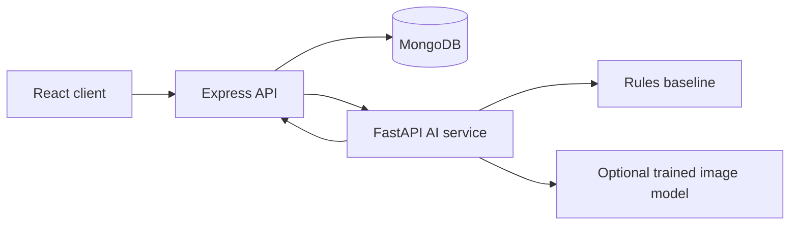

## AI architecture

CivicConnect keeps browser traffic behind the Express API. The browser submits a report to Node.js, Node.js stores the upload and calls the optional FastAPI service, and MongoDB stores the resulting recommendations separately from the citizen's original category and description.



The current AI result is explicitly marked as a rules-based baseline unless `GEMINI_API_KEY` is configured for the FastAPI service. Gemini can provide multimodal observations, category consistency, severity, and routing recommendations, but the backend validates its allowed values and authorities remain final decision-makers. AI failure does not prevent a complaint from being created; the API records `unavailable` and keeps its local fallback. No dataset, model accuracy, or neural-network confidence is fabricated. See [ai-service/README.md](ai-service/README.md) for endpoints, provider behavior, dataset requirements, and the planned MobileNetV3/EfficientNet-B0 training path.

Priority is calculated by the Node backend, not invented by Gemini. The configurable default weights are severity 30%, location risk 10%, community evidence 20%, persistence 20%, AI confidence 10%, and recent activity 10%. Community evidence is computed from actual nearby unresolved complaints within 500 metres, unique reporters, and reports created in the last 30 days. These are transparent engineering heuristics and are not presented as scientifically validated predictions.

Issue images are uploaded server-side to Cloudinary and only secure Cloudinary URLs and public IDs are stored in MongoDB. Configure `CLOUDINARY_CLOUD_NAME`, `CLOUDINARY_API_KEY`, and `CLOUDINARY_API_SECRET` in `server/.env`; the browser never receives the Cloudinary API secret.
# CivicConnect — Smart Civic Issue Management

CivicConnect connects citizens, municipal authorities, and field workers through a secure civic-issue workflow. Citizens submit geolocated evidence; authorities receive explainable AI recommendations, priority queues, analytics, and a map; every report has a persistent status history and public updates.

## Architecture

```text
React + Vite client  →  Express API + MongoDB  →  FastAPI AI contract
                         ↘ Cloudinary image storage
```

## Features

- JWT authentication, hashed passwords, and citizen/admin/department/worker roles
- Protected issue APIs with ownership and worker-assignment rules
- Report evidence, geolocation, departments, priority scoring, status history, comments, and notifications
- Citizen dashboard, authority operations queue, analytics, and OpenStreetMap view
- Explainable baseline AI routing, severity, and duplicate recommendations; ready to replace with trained inference

## Local setup

1. Copy `server/.env.example` to `server/.env`, set a unique `JWT_SECRET`, configure MongoDB, and add Cloudinary credentials.
2. Run `cd server && npm install && npm run seed && npm run dev`.
3. In another terminal, run `cd client && npm install && npm run dev`.
4. Optionally run `cd ai-service && python -m venv .venv && .venv/bin/pip install -r requirements.txt && .venv/bin/uvicorn app.main:app --reload --port 8000`.

For local development, the frontend uses the Vite proxy when `VITE_API_URL` is unset. For deployment, set `VITE_API_URL` to the public API URL, for example `https://your-api.example.com/api`, before building the frontend. The API health check is `/api/health` on that API host.

## Production note

Use managed MongoDB, deployment secrets, restricted Google Maps keys, and a trained model evaluated on a civic-issue dataset. Issue images are uploaded to Cloudinary by the API. The FastAPI endpoint uses Gemini when configured and retains a transparent fallback rather than claiming trained computer vision.
