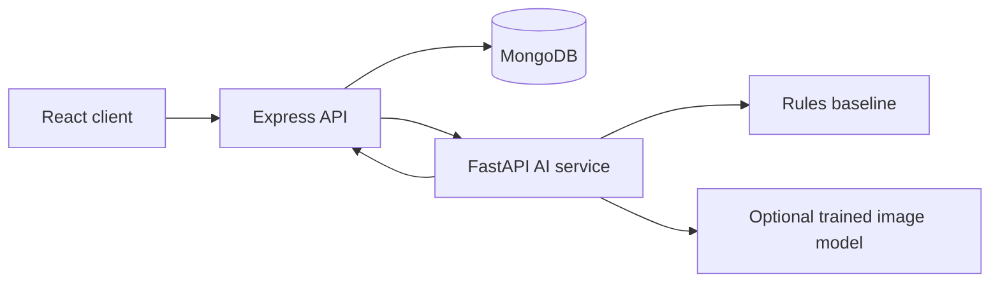

## AI architecture

CivicConnect keeps browser traffic behind the Express API. The browser submits a report to Node.js, Node.js stores the upload and calls the optional FastAPI service, and MongoDB stores the resulting recommendations separately from the citizen's original category and description.



The current AI result is explicitly marked as a rules-based baseline. It provides explainable text classification, severity heuristics, transparent priority scoring, department routing, and duplicate recommendations. AI failure does not prevent a complaint from being created; the API records `unavailable` and keeps its local fallback. No dataset, model accuracy, or neural-network confidence is fabricated. See [ai-service/README.md](ai-service/README.md) for endpoints, dataset requirements, and the planned MobileNetV3/EfficientNet-B0 training path.
# CivicConnect — Smart Civic Issue Management

CivicConnect connects citizens, municipal authorities, and field workers through a secure civic-issue workflow. Citizens submit geolocated evidence; authorities receive explainable AI recommendations, priority queues, analytics, and a map; every report has a persistent status history and public updates.

## Architecture

```text
React + Vite client  →  Express API + MongoDB  →  FastAPI AI contract
                         ↘ local uploads in development
```

## Features

- JWT authentication, hashed passwords, and citizen/admin/department/worker roles
- Protected issue APIs with ownership and worker-assignment rules
- Report evidence, geolocation, departments, priority scoring, status history, comments, and notifications
- Citizen dashboard, authority operations queue, analytics, and OpenStreetMap view
- Explainable baseline AI routing, severity, and duplicate recommendations; ready to replace with trained inference

## Local setup

1. Copy `server/.env.example` to `server/.env`, set a unique `JWT_SECRET`, and configure MongoDB.
2. Run `cd server && npm install && npm run seed && npm run dev`.
3. In another terminal, run `cd client && npm install && npm run dev`.
4. Optionally run `cd ai-service && python -m venv .venv && .venv/bin/pip install -r requirements.txt && .venv/bin/uvicorn app.main:app --reload --port 8000`.

The frontend is at `http://localhost:5173`; the API health check is `http://localhost:3000/api/health`.

## Production note

Use Cloudinary/S3 rather than local uploads, managed MongoDB, deployment secrets, and a trained model evaluated on a civic-issue dataset. The FastAPI endpoint is a transparent baseline rather than a claim of trained computer vision.
